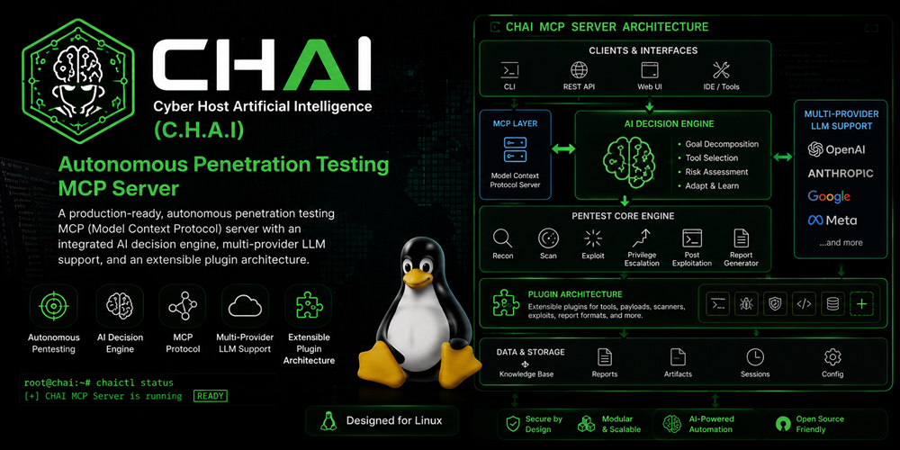
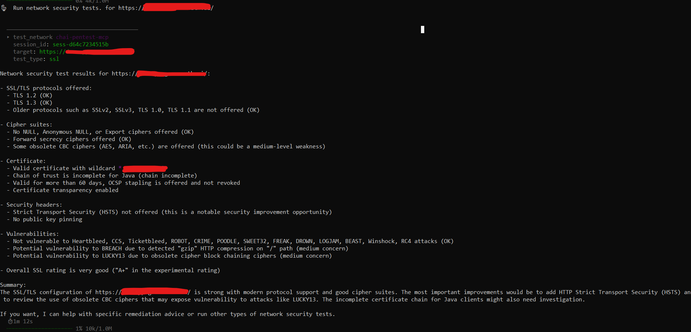

# CHAI

Cyber Host Artificial Intelligence (C.H.A.I)

A production-ready, autonomous penetration testing MCP (Model Context Protocol) server with an integrated AI decision engine, multi-provider LLM support, and an extensible plugin architecture. Designed for Raspberry Pi 4/5 running Kali Linux ARM64.

<p align="center">
	

</p>
## Architecture Overview

```
External Client (CHAI / any MCP tool)
         │  MCP stdio/SSE
         ▼
┌─────────────────────────────────────────┐
│         MCP Security Server             │
│                                         │
│  run_autonomous_scan()                  │
│         │                               │
│    ┌────▼────────────────────┐          │
│    │   execution_loop.py     │          │
│    │  (local, no LLM here)   │          │
│    │  tool1 → tool2 → tool3  │          │
│    └────┬────────────────────┘          │
│         │ at phase boundaries only      │
│    ┌────▼────────────────────┐          │
│    │   ai_planner.py         │          │
│    │  plan / evaluate /      │◄─────────┼── llm/provider_factory.py
│    │  summarize              │          │   (Azure / OpenAI / Claude /
│    └─────────────────────────┘          │    Bedrock / OpenRouter / HF)
│                                         │
│  All tools, safety, sandbox unchanged   │
└─────────────────────────────────────────┘
```

**Design Philosophy: THIN BRAIN, THICK LOOP**

- The internal LLM fires only at **decision boundaries**, not per-step
- A local `execution_loop` handles tool chaining deterministically between LLM calls
- Keeps token usage low (~6-10 calls per full pentest) and latency acceptable on a Pi 4

## Features

### Multi-Provider LLM Support

- **Azure OpenAI** (GPT-4.1, GPT-4o, GPT-5+, Kimi, DeepSeek via Azure AI Foundry)
- **Direct OpenAI** (GPT-4.1, GPT-4o, etc.)
- **Anthropic Claude** (Sonnet, Opus)
- **Amazon Bedrock** (Claude, Titan, Llama via AWS)
- **OpenRouter** (100+ models with one key)
- **HuggingFace** (DeepSeek, Qwen, Llama via Inference API)

### AI Decision Engine

- **plan()**: Decides what to test next based on findings
- **evaluate()**: Decides whether to continue or stop
- **summarize_for_report()**: Generates executive summary and remediation priorities

### Security & Sandboxing

- **firejail** profiles with rlimit restrictions
- **Linux cgroups** for resource limiting
- **Restricted user** (`pentester`) execution
- **Tiered safety policy** (Tier 1/2/3)
- **Immutable audit logging** of all commands and AI decisions

### Plugin System

- Auto-discovers plugins from `plugins/bundled/` and `plugins/external/`
- Drop-in plugin architecture — no core changes needed
- Bundled plugins: Feroxbuster, Metasploit, Burp Suite API

### Database

- **SQLite ONLY** — no Neo4j, Redis, or Postgres required
- WAL mode for better concurrency
- Knowledge graph with 50+ attack techniques and recursive CTE chain queries

## Project Structure

```
CHAI/
├── backend/                         # Python MCP server + REST API backend
│   ├── main.py                      # FastMCP server entry point
│   ├── run.py                       # Convenience launcher
│   ├── config.py                    # Configuration loader
│   ├── config.yaml                  # Main configuration (no secrets)
│   ├── .security.yml               # API keys (git-ignored)
│   ├── requirements.txt            # Python dependencies
│   ├── app_context.py              # Application context singleton
│   ├── web/                        # FastAPI REST API + WebSocket
│   │   └── api.py                  # API endpoints for React UI
│   │
│   ├── llm/                        # Multi-provider LLM adapter layer
│   ├── core/                       # Core engine (session, safety, planner)
│   ├── kb/                         # Knowledge Base
│   ├── tools/                      # Security testing tools
│   ├── plugins/                    # Plugin system
│   ├── models/                     # Data models
│   ├── utils/                      # Utilities
│   └── data/                       # Database schemas & profiles
│
├── ui/                             # React web dashboard (Vite + TypeScript)
│   ├── src/
│   │   ├── pages/                  # Dashboard, Sessions, Findings, etc.
│   │   ├── components/             # Sidebar, Layout, Toaster
│   │   ├── hooks/                  # WebSocket hook
│   │   ├── lib/                    # API client
│   │   └── types/                  # TypeScript types
│   └── dist/                       # Built static files (served by backend)
│
├── snapshots/                      # Screenshots
├── README.md
└── LICENSE
```

## Installation

### Prerequisites

- Any linux machine / Raspberry Pi 4/5 with Kali Linux ARM64 (bare metal, NO Docker)
- Python 3.11+
- firejail installed
- Kali Linux pentest tools (nmap, sqlmap, nuclei, ffuf, etc.)

### Setup

```bash
# Clone the repository
git clone https://github.com/NIHAR-SARKAR/CHAI.git
cd CHAI/backend

# Create virtual environment
python -m venv .venv
source .venv/bin/activate -- linux
.venv\Scripts\activate    -- windows

# Install dependencies
pip install -r requirements.txt

# Configure secrets
cp backend/.security.yml.example backend/.security.yml
chmod 600 backend/.security.yml
# Edit backend/.security.yml with your API keys

# Create required directories
### linux
sudo mkdir -p /opt/sessions /opt/logs /opt/kb /opt/mcp-security-server/plugins/external
sudo chown -R $(whoami) /opt/sessions /opt/logs /opt/kb

### windows PowerSheel
New-Item -ItemType Directory -Force -Path "C:\opt\sessions"
New-Item -ItemType Directory -Force -Path "C:\opt\logs"
New-Item -ItemType Directory -Force -Path "C:\opt\kb"
New-Item -ItemType Directory -Force -Path "C:\opt\mcp-security-server\plugins\external"

icacls "C:\opt" /grant "$env:USERNAME:(OI)(CI)F" /Ts -- Grant current user full permissions

# Install firejail profile
sudo cp backend/data/firejail/pentest.profile /etc/firejail/


# run server (MCP + Web UI)
cd backend
python main.py --transport streamable-http

# or from project root
python backend/main.py --transport streamable-http
```

<p align="center">
	

</p>

## Configuration

### `backend/config.yaml` (Main Config)

Edit `backend/config.yaml` to configure:

- Server transport (stdio or SSE)
- Sandbox limits (RAM, CPU, timeout)
- LLM provider selection
- Plugin enable/disable

Key sections:

```yaml
llm:
  active_provider: "azure_openai" # Change to your preferred provider
  fallback_provider: "openrouter" # Optional fallback

ai_planner:
  max_phases: 4 # Max autonomous phases
  stop_on_critical: true # Stop on critical findings

plugins:
  bundled:
    feroxbuster: true
    metasploit: false # Disabled by default (Tier 3)
    burp_api: false # Needs Burp Pro API key
```

### `backend/.security.yml` (Secrets)

```yaml
# NEVER commit this file
azure_openai:
  api_key: "your-azure-key"

openai:
  api_key: "your-openai-key"

anthropic:
  api_key: "your-anthropic-key"

# ... etc for each provider
```

## Web UI (React Dashboard)

CHAI now includes a modern React-based web dashboard served by the backend.

### Features

- **Dashboard** — Real-time stats, severity charts, session activity, recent sessions
- **Sessions** — Create, view, stop sessions; detailed session info with findings
- **Live Logs** — Real-time WebSocket streaming of scan progress and tool output
- **Findings** — Filter by severity/session, view evidence and remediation
- **Manual Tools** — Run any security tool with custom parameters
- **Reports** — Generate and download Markdown reports
- **Config** — View server config, LLM provider, loaded plugins, and tools

### Running the Web UI

The backend serves the built React app automatically on port **8060** (configurable in `backend/config.yaml`):

```bash
# 1. Start the backend (MCP server + Web UI)
cd backend
python main.py --transport streamable-http

# Web UI opens at http://localhost:8060
# MCP SSE endpoint is on http://localhost:9010/sse
```

### Development (React hot-reload)

```bash
cd ui
npm install      # first time only
npm run dev      # dev server on http://localhost:5240
```

The Vite dev proxy forwards `/api` and `/ws` to the backend on `:8060`.

### Building for Production

```bash
cd ui
npm run build    # outputs to ui/dist/
```

The backend auto-serves `ui/dist/` as a static SPA.

### Web UI Configuration

In `backend/config.yaml`:

```yaml
server:
  web_enabled: true # Enable/disable web UI
  web_port: 8060 # Port for the React dashboard
  sse_port: 9010 # Port for MCP SSE transport
```

### CHAI Integration

Add to your CHAI `config.json`:

**stdio transport:**

```json
{
  "tools": {
    "mcp": {
      "servers": {
        "chai-security": {
          "transport": "stdio",
          "command": "python",
          "args": ["-m", "main.py"],
          "cwd": "/opt/mcp-security-server",
          "env": {
            "PYTHONPATH": "/opt/mcp-security-server"
          },
          "discovery": "deferred"
        }
      }
    }
  }
}
```

**SSE transport (for remote Pi access):**

```json
{
  "tools": {
    "mcp": {
      "servers": {
        "chai-security": {
          "transport": "sse",
          "url": "http://raspberrypi.local:9010/sse"
        }
      }
    }
  }
}
```

## Usage

### Initialize a Session

```python
initialize_session(
    target="https://target.example.com",
    test_type="web_app",
    scope=["target.example.com"]
)
# Returns: {"session_id": "sess-abc-123", ...}
```

### Run Autonomous Scan (One Call, Complete Test)

```python
run_autonomous_scan(
    session_id="sess-abc-123",
    max_phases=4,
    stop_on_critical=True,
    generate_report=True,
    provider_override=None  # Uses backend/config.yaml active_provider
)
# Internally: plan → [recon → scan → inject] → evaluate → plan → [...] → report
# Returns after ~15-30 min:
# {
#   "phases_completed": 3,
#   "total_findings": 12,
#   "critical_count": 1,
#   "high_count": 4,
#   "report_path": "/opt/sessions/reports/sess-abc-123.md",
#   "status": "complete"
# }
```

### Manual Tool Calls

```python
# Reconnaissance
run_recon(session_id="sess-abc-123", target="target.example.com", recon_type="passive")

# Vulnerability scanning
scan_vulnerabilities(session_id="sess-abc-123", target="target.example.com", scanner="nuclei")

# Injection testing
test_injection(session_id="sess-abc-123", target="target.example.com", injection_type="sqli")

# Authentication testing
test_authentication(session_id="sess-abc-123", target="target.example.com", test_type="bypass")

# Network testing
test_network(session_id="sess-abc-123", target="target.example.com", test_type="ssl")

# Custom command
execute_command(session_id="sess-abc-123", command="nmap -sV target.example.com")

# Run plugin
run_plugin(session_id="sess-abc-123", plugin_name="feroxbuster", target="https://target.example.com")

# Generate report
generate_report(session_id="sess-abc-123", format="markdown")

# Check status
get_session_status(session_id="sess-abc-123")

# Emergency stop
emergency_stop(session_id="sess-abc-123")
```

## Adding a New LLM Provider

**Step 1** — Create `llm/providers/gemini.py`:

```python
from llm.base_provider import BaseLLMProvider, LLMResponse

class GeminiProvider(BaseLLMProvider):
    def __init__(self, config): ...
    @property
    def provider_name(self): return "gemini"
    async def complete(self, ...): ...
    async def health_check(self): ...
```

**Step 2** — Add one `case` to `llm/provider_factory.py`:

```python
case "gemini":
    from llm.providers.gemini import GeminiProvider
    return GeminiProvider(config)
```

**Step 3** — Add config block to `backend/config.yaml`:

```yaml
llm:
  gemini:
    enabled: true
    model: "gemini-2.5-pro"
    api_base: "https://generativelanguage.googleapis.com/v1beta/openai"
```

**Step 4** — Add key to `backend/.security.yml`:

```yaml
gemini:
  api_key: ""
```

**Step 5** — Change `active_provider: "gemini"` in `backend/config.yaml`.

**That's it. No other files change.**

## Adding a New Pentest Plugin

**Step 1** — Create `plugins/external/gospider_plugin.py`:

```python
from plugins.plugin_base import PentestPlugin, PluginMetadata, PluginResult

class GospiderPlugin(PentestPlugin):
    @property
    def metadata(self):
        return PluginMetadata(
            name="gospider", display_name="GoSpider Web Crawler",
            version="1.1.6", description="Fast web spider",
            tier="tier1", requires_binary="gospider",
            tags=["web", "recon", "crawler"],
        )
    async def run(self, session_id, target, args, process_controller, safety_policy, session_manager):
        # Build command, validate through safety_policy, execute via process_controller
        ...
```

**Step 2** — Restart the server. The plugin auto-loads.

**That's it. No changes to core application.**

## LLM Call Budget

For a 4-phase autonomous scan:

- Phase 1: plan() + evaluate() = 2 calls
- Phase 2: plan() + evaluate() = 2 calls
- Phase 3: plan() + evaluate() = 2 calls
- Phase 4: plan() + evaluate() = 2 calls
- Report: summarize_for_report() = 1 call
- **Total: ~9 LLM calls per full pentest**

This keeps token usage low and latency acceptable on a Raspberry Pi 4.

## Safety & Compliance

- **Command denylist**: Dangerous commands (rm -rf /, fork bombs, etc.) are blocked
- **Tier system**: Tools classified by risk (Tier 1/2/3)
- **Scope checking**: Commands validated against defined scope
- **Rate limiting**: Per-tier concurrent execution limits
- **Sandboxing**: All commands run through firejail with resource limits
- **Audit trail**: Every command and AI decision is logged immutably

## License

MIT License — See LICENSE file for details.


## Contributing

1. Fork the repository
2. Create a feature branch
3. Make your changes
4. Add tests (pytest)
5. Submit a pull request

## Support

For issues and questions:

- GitHub Issues: [https://github.com/NIHAR-SARKAR/CHAI/issues](https://github.com/NIHAR-SARKAR/CHAI/issues)
- Documentation: [https://github.com/NIHAR-SARKAR/CHAI/blob/main/README.md](https://github.com/NIHAR-SARKAR/CHAI/blob/main/README.md)
- Site Url: [https://aithread.in](https://aithread.in)
